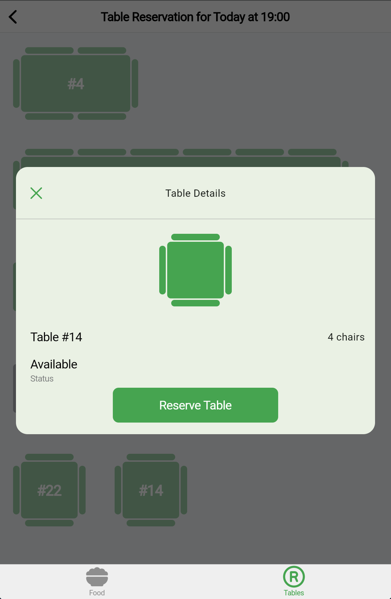

# 🌟 Restinio App

Welcome to **Restinio**, an intuitive food ordering and table reservation application that is easy to use and works across all devices.

## 🚀 Live Demo

Experience the app in action: [**Live Web Demo**](https://restinio-app.web.app)

---

## 📸 Screenshots

Take a peek at some of the core screens of **Restinio**:

| Small Screen View                          | Food Details                            |
|--------------------------------------------|-----------------------------------------|
|  |  |

| Table Reservation Dialog                   | Large Screen View                       |
|--------------------------------------------|-----------------------------------------|
|  |  |

---

## ✨ Features

- 📅 **Table Reservation** – Reserve a table with just a few clicks.
- 🖥️ **Responsive Design** – Optimized for all screen sizes, ensuring a seamless experience on both mobile and desktop devices.

---

## 📋 Requirements

- Install **FVM**: [https://fvm.app/documentation/getting-started/installation](https://fvm.app/documentation/getting-started/installation) or use **Flutter 3.24.3**.
  
---

## 🛠️ Workspace Setup

1. **Clone** this repository.
2. In the main directory, run one of the following commands:
   - `fvm use` (if you're using FVM).
   - `flutter pub get` (if Flutter 3.24.4 is installed).

---

## 📝 Notes

- This project is part of a challenge, and the generated code files have been included to simplify the review process.
